# Campus Lab - Architecture

This document provides a comprehensive technical breakdown of the **Campus Lab** platform - a full-stack competitive programming judge system built for academic environments.

---

## Table of Contents

- [System Overview](#system-overview)
- [High-Level Architecture](#high-level-architecture)
- [Technology Stack](#technology-stack)
- [Backend Architecture](#backend-architecture)
  - [Module Structure](#module-structure)
  - [API Routes](#api-routes)
  - [Authentication Flow](#authentication-flow)
  - [Code Execution Pipeline](#code-execution-pipeline)
  - [Submission Pipeline](#submission-pipeline)
  - [Contest System](#contest-system)
- [Database Schema](#database-schema)
- [Frontend Architecture](#frontend-architecture)
  - [Page Structure](#page-structure)
  - [Component Hierarchy](#component-hierarchy)
  - [State Management](#state-management)
- [Infrastructure & Deployment](#infrastructure--deployment)
- [Data Flow Diagrams](#data-flow-diagrams)

---

## System Overview

Campus Lab is a **LeetCode-style competitive programming platform** designed for college lab environments. It allows students to:

- Browse and solve DSA problems across 15+ topics
- Write and execute code in **C++, Python, Java, and Rust**
- Get instant feedback via an integrated **Judge0** code execution engine
- Compete in real-time **contest rooms** with leaderboards
- Track their progress through a **profile dashboard**

---

## High-Level Architecture

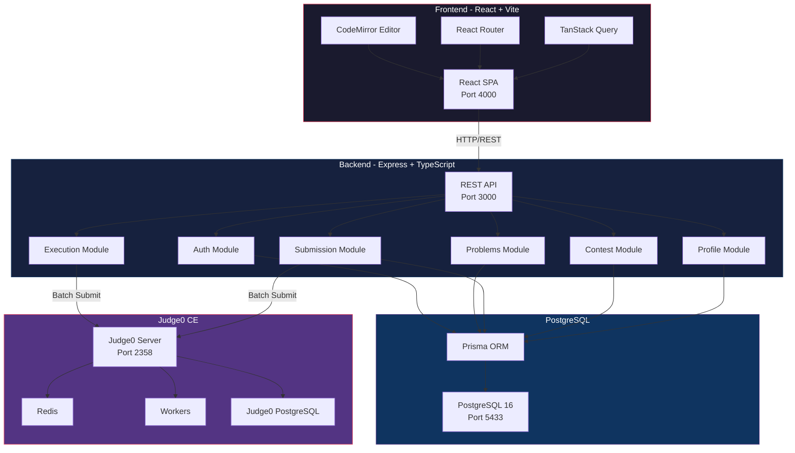

---

## Technology Stack

| Layer | Technology | Purpose |
|---|---|---|
| **Frontend** | React 19, Vite 6, TypeScript | SPA framework & build tool |
| **Styling** | TailwindCSS 4, Motion (Framer) | UI design & animations |
| **Code Editor** | CodeMirror 6 | In-browser code editing with syntax highlighting |
| **State** | TanStack React Query | Server-state caching & synchronization |
| **Routing** | React Router v7 | Client-side navigation |
| **Backend** | Express 5, TypeScript, tsx | REST API server |
| **ORM** | Prisma 7 (with `@prisma/adapter-pg`) | Type-safe database access |
| **Database** | PostgreSQL 16 | Primary relational data store |
| **Auth** | JWT (httpOnly cookies), bcrypt | Authentication & session management |
| **Validation** | Zod 4 | Request body schema validation |
| **Code Judge** | Judge0 CE v1.13.1 (self-hosted) | Sandboxed code compilation & execution |
| **Containerization** | Docker, Docker Compose | Service orchestration |

---

## Backend Architecture

### Module Structure

The backend follows a **modular architecture** where each domain feature is isolated into its own module with a consistent file structure:

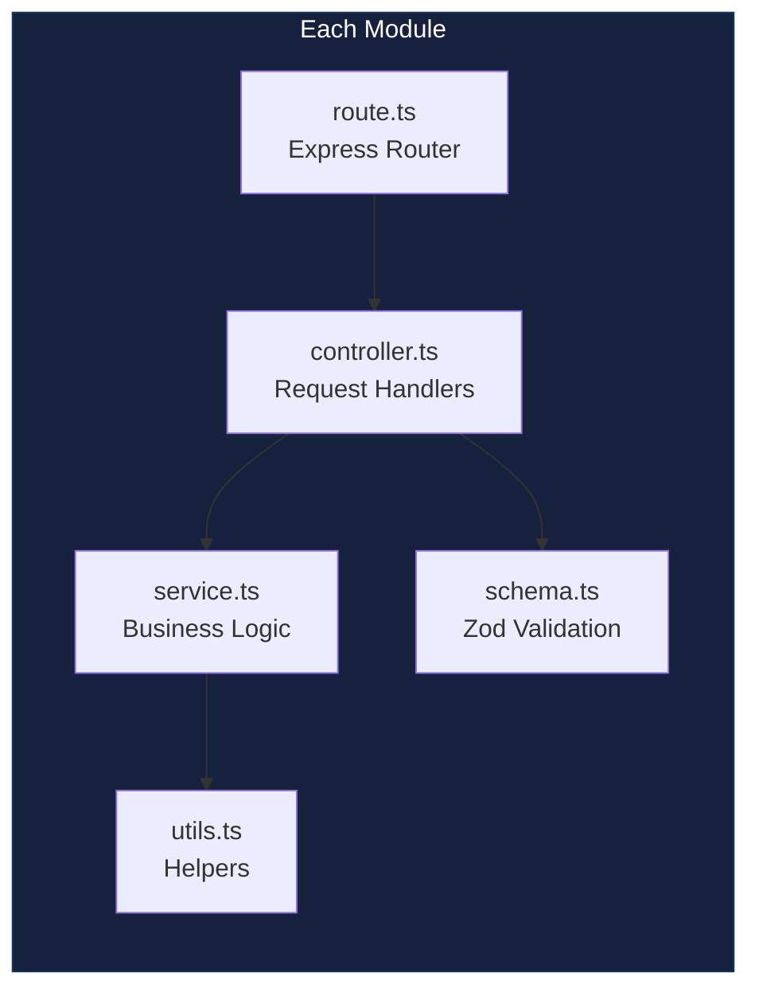

Each module (auth, problems, execution, submission, contest, profile) follows this convention with its own route, controller, service, schema, and utils files. Shared utilities like the Judge0 API client, code runner, and bootstrap logic reside in `server/src/shared/`.

### API Routes

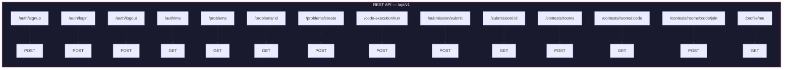

| Endpoint | Method | Auth | Description |
|---|---|---|---|
| `/auth/signup` | POST | No | Register a new user |
| `/auth/login` | POST | No | Login and receive JWT cookie |
| `/auth/logout` | POST | Yes | Clear session cookie |
| `/auth/me` | GET | Yes | Get current authenticated user |
| `/problems` | GET | Yes | List all problems (summary) |
| `/problems/:id` | GET | Yes | Get full problem details |
| `/problems/create` | POST | Yes (Admin) | Create a new problem |
| `/code-execution/run` | POST | Yes | Run code against custom test cases |
| `/submission/submit` | POST | Yes | Submit code for judging |
| `/submission/:id` | GET | Yes | Get submission details |
| `/contests/rooms` | POST | Yes | Create a contest room |
| `/contests/rooms/:code` | GET | Yes | Get contest room details |
| `/contests/rooms/:code/join` | POST | Yes | Join an existing contest |
| `/profile/me` | GET | Yes | Get user profile & stats |

### Authentication Flow

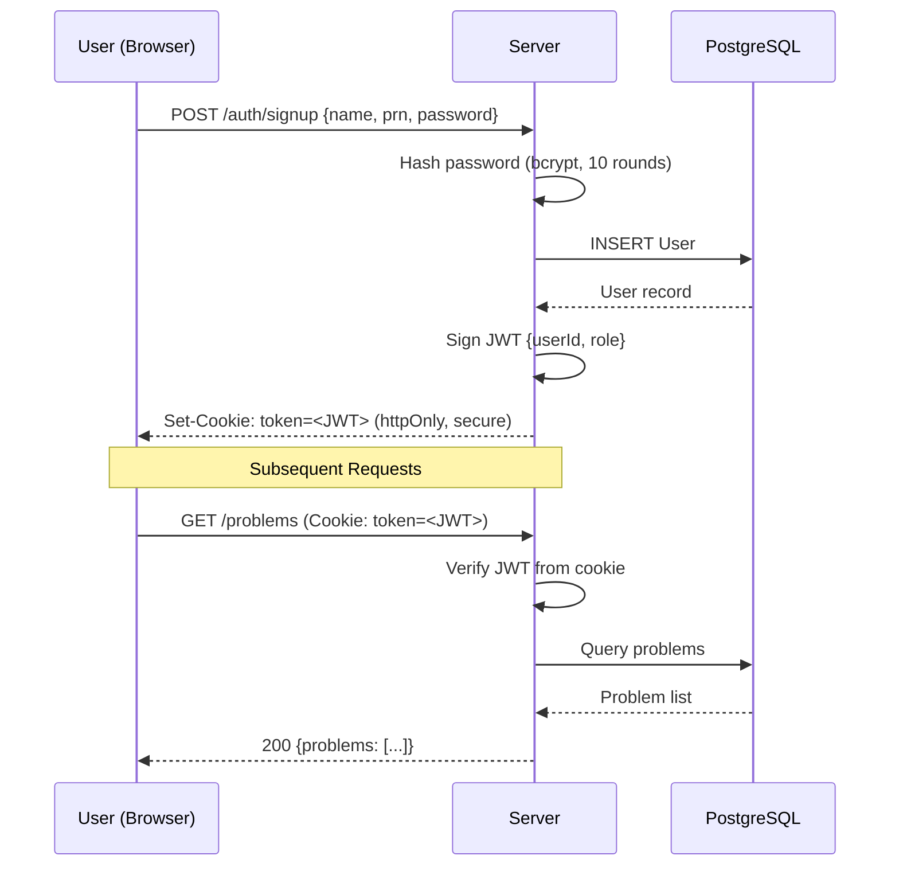

### Code Execution Pipeline

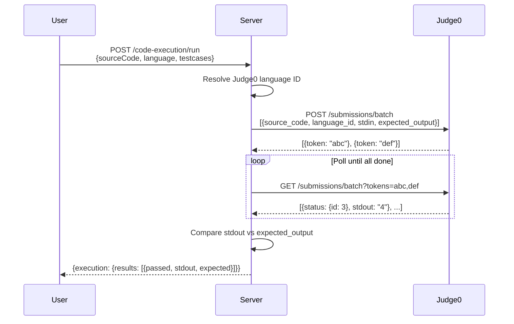

### Submission Pipeline

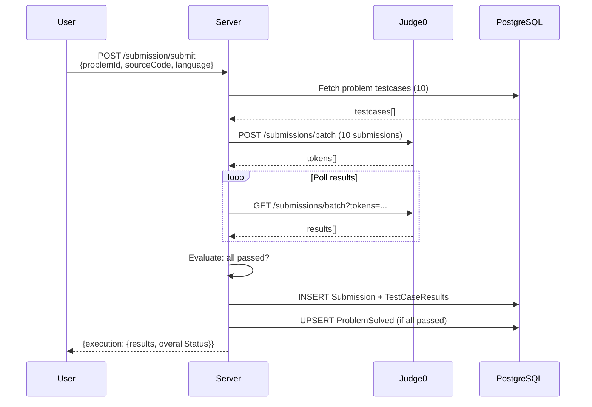

### Contest System

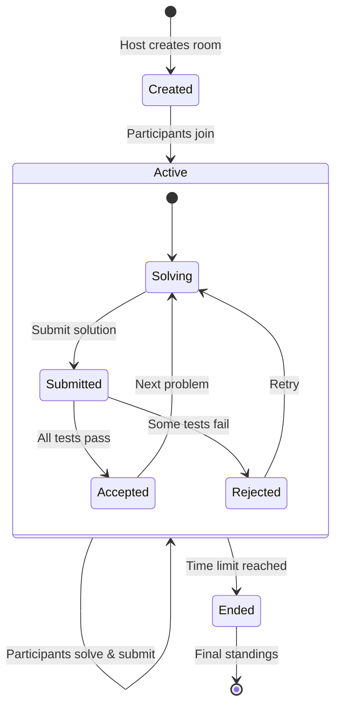

A contest room stores:
- **Room code** (unique 6-char identifier)
- **Problem IDs** (randomly selected from chosen topics)
- **Participants** (array of `{userId, joinedAt}`)
- **Standings** (per-user score, solved problem IDs, last accepted timestamp)
- **Time limit** and **start/end timestamps**

---

## Database Schema

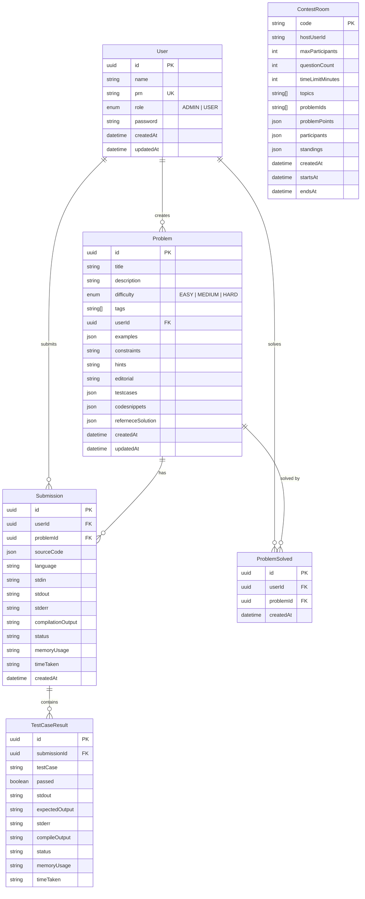

### Key Design Decisions

- **JSON fields** (`examples`, `testcases`, `codesnippets`, `referneceSolution`) store structured data that doesn't need relational querying — avoids excessive normalization
- **ProblemSolved** is a denormalized tracking table with a `@@unique([userId, problemId])` constraint for fast profile lookups
- **ContestRoom** uses JSON arrays/objects for participants and standings to support real-time contest state without complex joins

---

## Frontend Architecture

### Page Structure

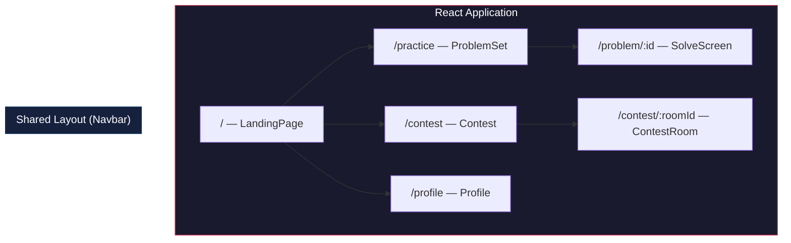

### State Management

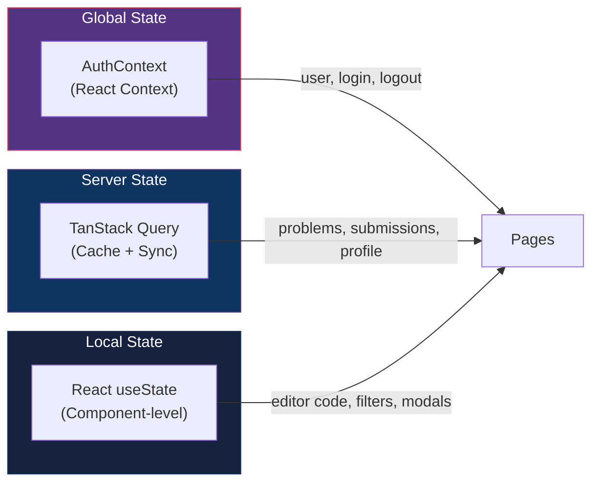

- **AuthContext**: Global authentication state (current user, login/logout functions)
- **TanStack Query**: Caches API responses for problems, submissions, profiles, and contests
- **Local State**: Component-scoped state for editor content, UI interactions, and form inputs

---

## Infrastructure & Deployment

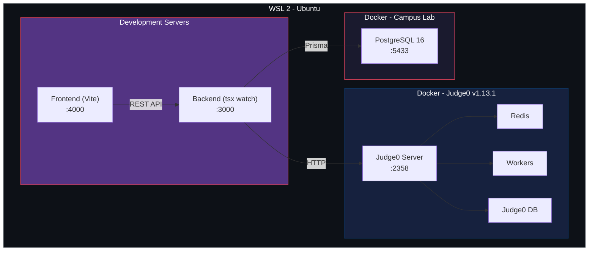

### Ports Summary

| Service | Port | Description |
|---|---|---|
| Frontend (Vite) | `4000` | React development server |
| Backend (Express) | `3000` | REST API server |
| PostgreSQL | `5433` | Campus Lab database |
| Judge0 Server | `2358` | Code execution API |

---

## Data Flow Diagrams

### Complete User Journey: Solving a Problem

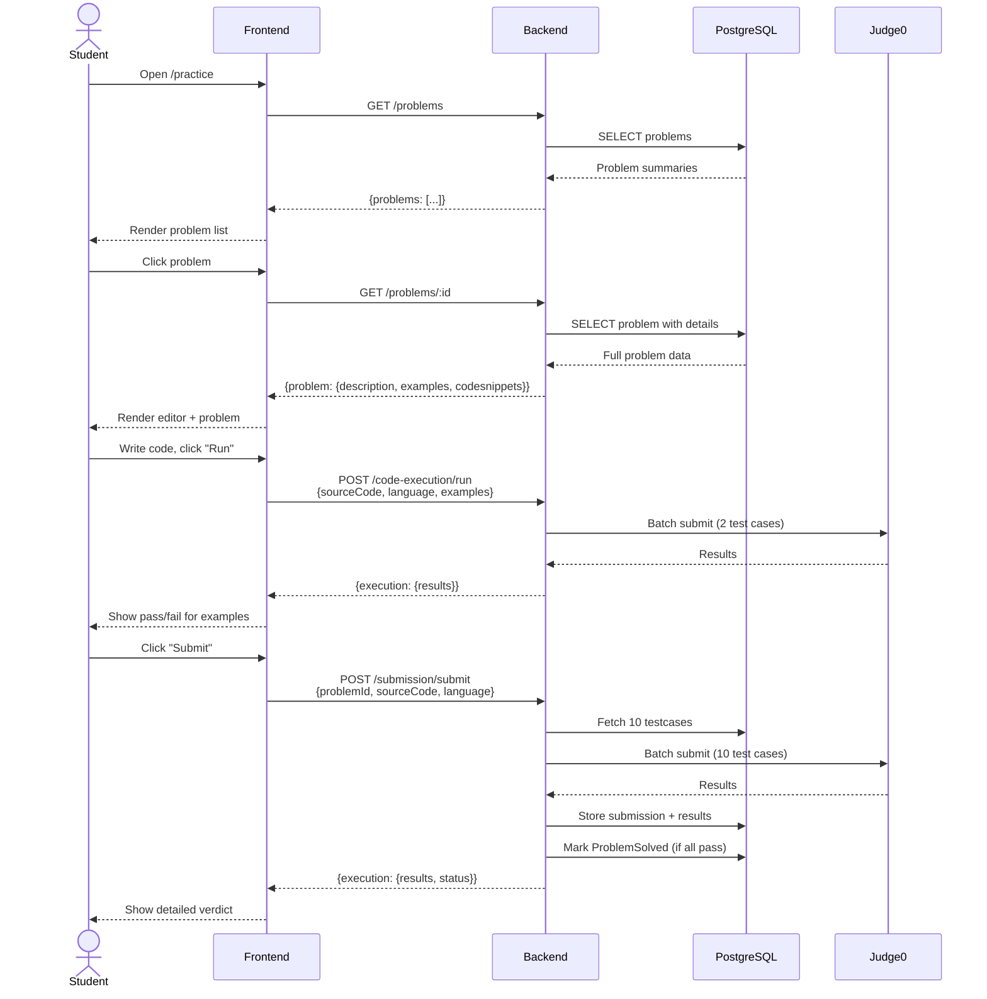
